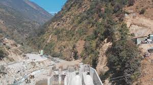

# Likhu-2 Hydropower Project

Likhu 2 HEP is located in Gumdel and Bhakanje VDCs of Ramechhap district and Solukhumbu district. It is a Pondage Run - of – River (PROR) scheme project cascaded to Likhu 1 HEP. . The capacity of the project is 55 MW. The land required for the project development is 31.9 hectares of which 26.96 hectares of land area falls under the ownership of the government and the community. The general layout of the project comprises of a diversion gravity weir with a gated under sluice, orifice side intake, gravel trap, settling basin, regulating pond, tunnel, surge shaft, penstock pipe inside the tunnel, surface powerhouse and tail race canal. 

